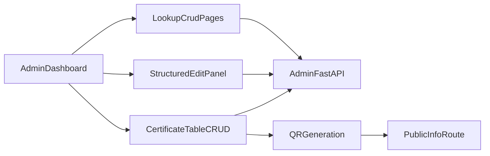

# Admin Dashboard Table-First CRUD Plan

## Current State Review
- Certificate data model and relation tables already exist (`certificates`, `courses`, `institutions`, `partners`) via [backend/supabase/migrations/001_create_certificates.sql](backend/supabase/migrations/001_create_certificates.sql) and [backend/supabase/migrations/002_admin_dashboard_foundation.sql](backend/supabase/migrations/002_admin_dashboard_foundation.sql).
- Admin APIs already support CRUD + QR generation in [backend/app/routes/admin.py](backend/app/routes/admin.py).
- Public verification path is already aligned with `/info/{certificate_id}` in [backend/app/routes/public.py](backend/app/routes/public.py) and [frontend/src/app/info/[certificateId]/page.tsx](frontend/src/app/info/[certificateId]/page.tsx).
- Main gap: dashboard is read-only list with navigation links, while create/edit are form-driven on separate pages in [frontend/src/app/admin/dashboard/page.tsx](frontend/src/app/admin/dashboard/page.tsx), [frontend/src/app/admin/certificates/new/page.tsx](frontend/src/app/admin/certificates/new/page.tsx), and [frontend/src/app/admin/certificates/[certificateId]/page.tsx](frontend/src/app/admin/certificates/[certificateId]/page.tsx).
- Related pages for courses/institutions/partners exist, but not full inline CRUD consistency (e.g., limited edit/delete UX) in [frontend/src/app/admin/courses/page.tsx](frontend/src/app/admin/courses/page.tsx), [frontend/src/app/admin/institutions/page.tsx](frontend/src/app/admin/institutions/page.tsx), [frontend/src/app/admin/partners/page.tsx](frontend/src/app/admin/partners/page.tsx).

## Target Architecture

## Implementation Plan
1. Build a unified certificate management workspace on [frontend/src/app/admin/dashboard/page.tsx](frontend/src/app/admin/dashboard/page.tsx):
   - searchable/paginated table (certificate_id, name, course, institution, partner, status, issue_date, actions)
   - inline row add + inline quick edits for primary fields
   - row actions: save, cancel, delete, generate QR, open public `/info/{certificate_id}`
2. Add a structured side edit panel (same page) for full record details:
   - selecting a row hydrates panel fields
   - relation dropdowns (`course_id`, `institution_id`, `partner_id`) auto-fill derived display fields
   - panel save updates the selected record without route change
   - include inline quick-add forms/modals for Course/Institution/Partner creation directly from each dropdown context
   - include a clear admin logout action in the side panel navigation/actions area
3. Refactor admin frontend API layer in [frontend/src/lib/admin-api.ts](frontend/src/lib/admin-api.ts):
   - central request helper with status/error parsing
   - add typed methods for certificates and lookups (list/create/update/delete/generateQR)
   - support optimistic updates + rollback hooks for table edits
   - enforce Supabase as the source of truth by rehydrating canonical rows after mutations
4. Strengthen typings in [frontend/src/lib/types.ts](frontend/src/lib/types.ts):
   - split `CertificateListItem` vs `CertificateDetail`
   - add lookup DTOs and mutation payload types for safer inline editing
5. Expand backend listing/filter support in [backend/app/routes/admin.py](backend/app/routes/admin.py):
   - optional query params (`q`, `status`, `course_id`, `institution_id`, `partner_id`, `limit`, `offset`)
   - include relationship display fields directly in list response for dashboard rendering
6. Upgrade lookup pages to full CRUD (create/read/update/delete) with table UX:
   - [frontend/src/app/admin/courses/page.tsx](frontend/src/app/admin/courses/page.tsx)
   - [frontend/src/app/admin/institutions/page.tsx](frontend/src/app/admin/institutions/page.tsx)
   - [frontend/src/app/admin/partners/page.tsx](frontend/src/app/admin/partners/page.tsx)
   - keep full-page add forms available as fallback management screens, in addition to side-panel quick-add
7. Keep QR and URL flow strict and visible:
   - ensure every created/updated cert stores `verification_url` as `/info/{certificate_id}`
   - show QR availability column in dashboard table
   - one-click QR generation using existing `/api/admin/certificates/{certificate_id}/qr`
8. Add focused tests for admin data flows:
   - extend [backend/tests/test_admin_certificates.py](backend/tests/test_admin_certificates.py) for CRUD + filters + QR endpoint auth/error cases
   - add frontend tests for dashboard table state transitions and lookup CRUD pages
9. Add real-time mirroring between Supabase and dashboard:
   - subscribe to Supabase realtime events for `certificates`, `courses`, `institutions`, and `partners`
   - apply insert/update/delete patches to in-memory table state immediately
   - fallback to automatic refetch if realtime channel drops
   - add a visible sync status indicator in admin side panel (connected/reconnecting)

## Suggested Enhancements (After Core CRUD)
- Conflict resolution UX for concurrent edits (warn when another admin changes the same row).
- Soft-delete/archive for certificates and lookups instead of hard delete.
- Audit trail table (`created_by`, `updated_by`, timestamp, changed_fields`) for admin changes.
- CSV import/export for bulk certificate operations.
- Duplicate ID prevention UI checks and human-readable validation errors.
- Basic role permissions (`viewer/editor/admin`) for safer multi-staff usage.

## Delivery Order
- Phase 1: Dashboard table CRUD + search + structured edit panel.
- Phase 2: Lookup pages full CRUD standardization.
- Phase 3: Backend filter/query improvements + tests.
- Phase 4: Real-time Supabase sync + conflict handling + sync status UX.
- Phase 5: Polish (optimistic UX, validation, helpful toasts, error handling).