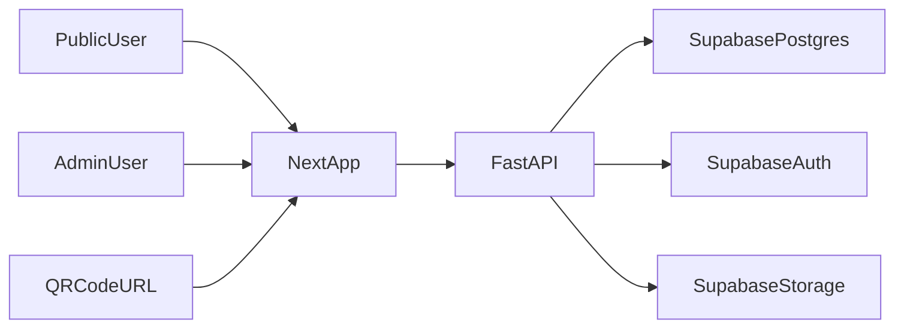

# Everify Clone Implementation Plan

## Architecture
- `frontend` (Next.js + React): public pages (`/`, `/info/[certificateId]`) and protected admin pages (`/admin/*`).
- `backend` (FastAPI): REST API for verify lookup and admin CRUD.
- Supabase:
  - Postgres table for certificates.
  - Supabase Auth for admin login.
  - Optional Storage bucket for student images.

## Project Setup
- Create monorepo-style folders:
  - [frontend](frontend)
  - [backend](backend)
- Add environment templates:
  - [frontend/.env.example](frontend/.env.example)
  - [backend/.env.example](backend/.env.example)
- Define shared local-dev instructions in [README.md](README.md).

## Data Model (Supabase)
- Create `certificates` table with:
  - `id` (uuid, pk)
  - `certificate_id` (text, unique, indexed)
  - `full_name` (text)
  - `course` (text)
  - `issue_date` (date)
  - `completion_date` (date, nullable)
  - `enrollment_date` (date, nullable)
  - `duration` (text, nullable)
  - `institute` (text, nullable)
  - `registration_number` (text, nullable)
  - `issuing_authority` (text, nullable)
  - `date_of_birth` (date, nullable)
  - `nic_number` (text, nullable)
  - `email` (text, nullable)
  - `status` (`valid|invalid` check constraint)
  - `image_url` (text, nullable)
  - `institution_logo_url` (text, nullable)
  - `partner_logo_url` (text, nullable)
  - `created_at`, `updated_at`
- Add SQL migration file in [backend/supabase/migrations/001_create_certificates.sql](backend/supabase/migrations/001_create_certificates.sql).

## Backend (FastAPI)
- Bootstrap API service in [backend/app/main.py](backend/app/main.py).
- Add modules:
  - [backend/app/config.py](backend/app/config.py) for env/settings.
  - [backend/app/db.py](backend/app/db.py) for Supabase client.
  - [backend/app/schemas.py](backend/app/schemas.py) for Pydantic models.
  - [backend/app/routes/public.py](backend/app/routes/public.py) for public verification.
  - [backend/app/routes/admin.py](backend/app/routes/admin.py) for admin CRUD.
  - [backend/app/auth.py](backend/app/auth.py) for Supabase token validation.
- Endpoints:
  - `GET /api/verify/{certificate_id}` (public)
  - `GET /api/info/{certificate_id}` (public detail)
  - `POST /api/admin/certificates` (admin)
  - `PUT /api/admin/certificates/{certificate_id}` (admin)
  - `DELETE /api/admin/certificates/{certificate_id}` (admin)
  - `GET /api/admin/certificates` (admin list/search)

## Frontend (Next.js)
- Public UI:
  - [frontend/src/app/page.tsx](frontend/src/app/page.tsx): certificate input, verify button, QR scanner option.
  - [frontend/src/app/info/[certificateId]/page.tsx](frontend/src/app/info/[certificateId]/page.tsx): valid/invalid result view.
  - [frontend/src/components/verification-form.tsx](frontend/src/components/verification-form.tsx).
  - [frontend/src/components/certificate-card.tsx](frontend/src/components/certificate-card.tsx).
- Admin UI:
  - [frontend/src/app/admin/login/page.tsx](frontend/src/app/admin/login/page.tsx): Supabase Auth sign-in.
  - [frontend/src/app/admin/dashboard/page.tsx](frontend/src/app/admin/dashboard/page.tsx): list certificates.
  - [frontend/src/app/admin/certificates/new/page.tsx](frontend/src/app/admin/certificates/new/page.tsx): create certificate.
  - [frontend/src/app/admin/certificates/[certificateId]/page.tsx](frontend/src/app/admin/certificates/[certificateId]/page.tsx): edit/delete.
- Add route protection middleware in [frontend/src/middleware.ts](frontend/src/middleware.ts).

## UI Fidelity Requirements (From Your Screenshots)
- Match the provided visual style closely (layout spacing, card structure, soft gradient background, rounded cards, subtle borders/shadows).
- Home page must replicate:
  - top-left brand mark + name
  - top-right `Staff Portal Login`
  - center title `Certificate Verification`
  - horizontal input + blue `Verify Now` button
  - centered sample hint and minimal footer
- Certificate info page must replicate:
  - top header row (`Information Access` + verified badge)
  - hero card with student photo, `AUTHENTIC RECORD` badge, full name, program, cert id/institute chips, status card
  - three lower cards (`Personal Data`, `Academic Details`, `Timeline`) and issuing authority strip
  - institution logos near footer and tiny legal text
- Implement responsive behavior so mobile/tablet keep the same hierarchy without breaking the card composition.
- Use reusable style tokens in [frontend/src/styles/tokens.css](frontend/src/styles/tokens.css) for consistent colors/radius/shadows.

## Seed Record and Display Contract
- Add one seeded student record matching your sample display in:
  - [backend/scripts/seed_sample_record.py](backend/scripts/seed_sample_record.py)
- Ensure `/info/{certificate_id}` renders these fields when present:
  - full name, program/course, certificate id
  - enrollment date, completion date, duration
  - date of birth, NIC number, email
  - institute, registration number, issuing authority
  - student image + institution/partner logos
- If optional fields are missing, render graceful placeholders while keeping the same card layout.

## QR Verification Flow
- Generate certificate URL format: `/info/{certificate_id}`.
- Add scanner component in [frontend/src/components/qr-scanner.tsx](frontend/src/components/qr-scanner.tsx) using browser camera.
- On scan success, navigate to `/info/{certificate_id}`.

## Security and Access Control
- Public routes are read-only and expose only required fields.
- Admin routes require verified Supabase JWT.
- Backend validates all payloads and rejects malformed IDs.
- Add basic rate limiting guard placeholder for verification endpoint (configurable for production).

## Testing and Validation
- Backend tests:
  - [backend/tests/test_public_verify.py](backend/tests/test_public_verify.py)
  - [backend/tests/test_admin_certificates.py](backend/tests/test_admin_certificates.py)
- Frontend tests:
  - [frontend/src/components/__tests__/verification-form.test.tsx](frontend/src/components/__tests__/verification-form.test.tsx)
  - [frontend/src/app/info/[certificateId]/__tests__/page.test.tsx](frontend/src/app/info/[certificateId]/__tests__/page.test.tsx)
- Manual checks:
  - Valid certificate lookup.
  - Invalid certificate lookup.
  - Admin login/logout.
  - Create/update/delete certificate lifecycle.
  - QR scan redirect.

## Delivery Phases
1. Scaffold frontend/backend + env wiring.
2. Implement Supabase schema and backend public verify APIs.
3. Build screenshot-matching public pages (`/`, `/info/[certificateId]`) with style tokens.
4. Add admin auth and CRUD APIs/UI for full certificate profile fields.
5. Add seed script for the sample student record and verify page rendering.
6. Add QR scan flow and polish.
7. Add tests and final documentation in [README.md](README.md).